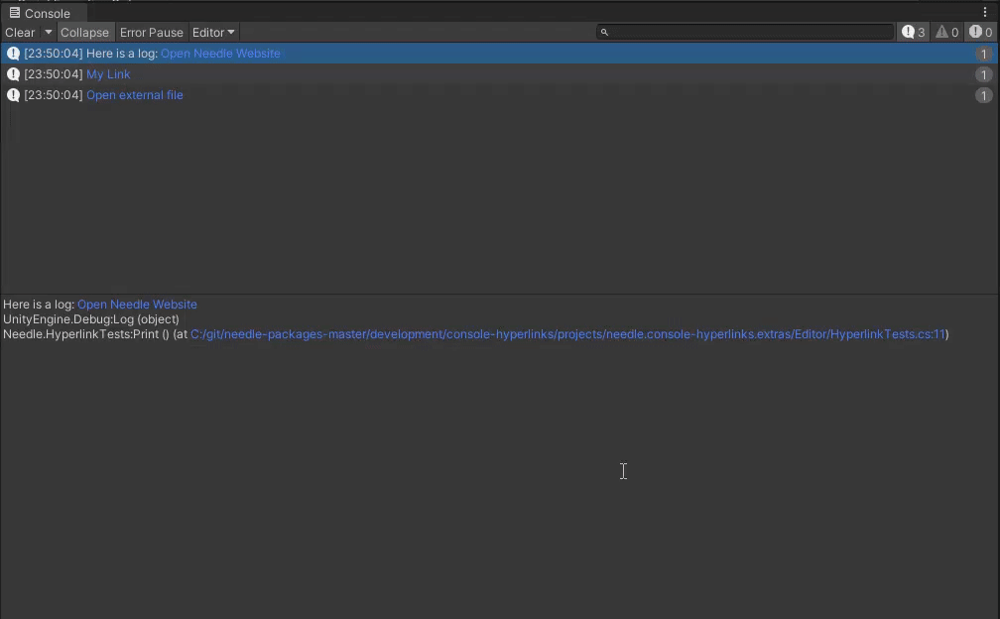
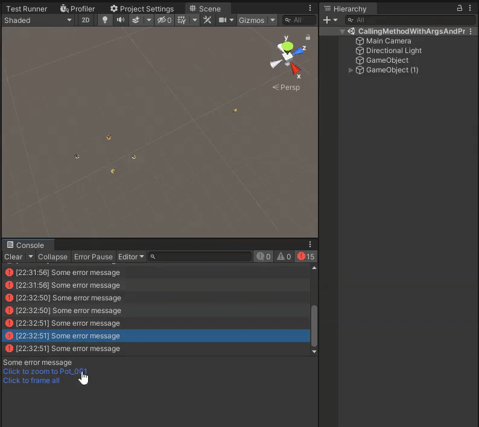

# Console Hyperlinks
## Adds hyperlink handling for Unity console logs and more



## How to use 💡
1) Decorate a static method that accepts two string arguments with a ``Needle.HyperlinkCallback`` attribute with a ``void`` or ``bool`` return type (return ``true`` if your implementation handled the provided ``path`` and no other callbacks should be called).

   ```csharp
   [Needle.HyperlinkCallback]
   private static bool OnHyperlinkClicked(string path, string line)
   ```

2) That's it. Now when you log something to the console using the following pattern you will receive a callback: ``<a href=\"My callback string">My clickable link</a>``. You can also just use the handy ``LinkTo(string url)`` extension method like this: ``"Open Unity Website".LinkTo("https://www.unity.com")``


## Extensible 🧩
Of course you can implement anything you like as a link. A default implementation for urls is already provided with the package.

**For example**: add support to frame objects by clicking a link in a console message


## Unity Versions ✔️
Tested with Unity 2019.4 and above

## Support 💚
This project is supported via donations. If you or your team have found it useful, please consider supporting further development through [patreon](https://www.patreon.com/needletools)


## Contact ✒️
<b>[🌵 needle — tools for unity](https://needle.tools)</b> • 
[@NeedleTools](https://twitter.com/NeedleTools) • 
[@marcel_wiessler](https://twitter.com/marcel_wiessler) • 
[@hybridherbst](https://twitter.com/hybridherbst) • 
[Needle Discord](https://discord.gg/CFZDp4b)

